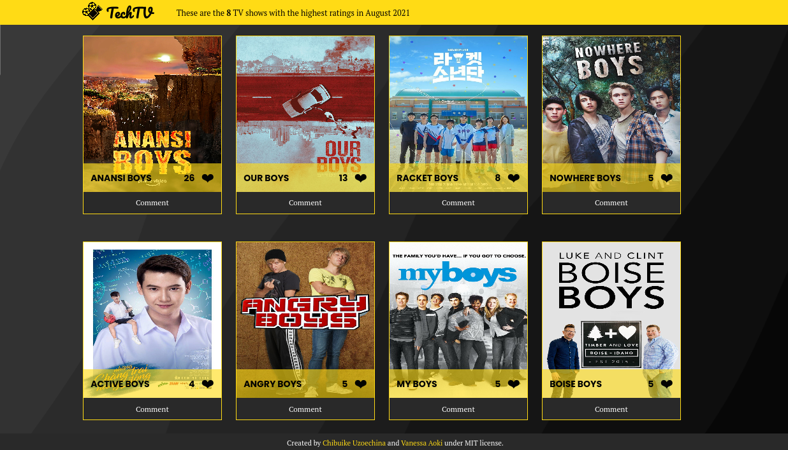

<p align="center">
  <a href="https://www.microverse.org/">
    
  </a>
  <a href="https://github.com/VanessaAoki/JS-Capstone/blob/main/LICENSE">
    
  </a>
  <a href="https://github.com/VanessaAoki/JS-Capstone">
    
  </a>
  <a href="https://github.com/VanessaAoki/JS-Capstone">
    
  </a>
</p>

# JS-Capstone: TechTV
TechTV is a website that displays the shows that received highest ratings from viewers every month. It allows viewers to like and add comments to shows they enjoyed; it also enables them view both the number of comments and likes a show has received from previous viewers. 

<p align="center">
    
    <br>
    
</p>

## Built With

- HTML, CSS, JavaScript & Webpack;
- Visual Studio, Git & GitHub;

## Getting Started

### Running locally
To run this project, you only need a computer with a browser (like Google Chrome, Mozilla Firefox, Microsoft Edge, Apple Safari, etc.) installed, and follow these steps:

1. In your terminal, type the following, to clone this repository:

```sh
$ git clone https://github.com/VanessaAoki/JS-Capstone.git
```

2. After, run the following commands in your terminal:

```sh
$ cd JS-Capstone
$ npm install
$ npm run build
$ cd dist
```
<details align="right">
<summary><small>What are these commands?</summary>
- the `$ cd` command is used to move to different folders. <br>
- while `$ npm run build` is used to compile the aplication files.</small>
</details>

3. Open the `index.html` file and run the application;

## Author

👤 Chibuike Uzoechina

- GitHub: [@Chike1990](https://github.com/Chike1990)
- Twitter: [@ChibuikeUzoechi](https://twitter.com/ChibuikeUzoechi)
- LinkedIn: [@Chibuike-Uzoechina](https://www.linkedin.com/in/chibuike-uzoechina-630857102)


👩🏼‍💻 **Vanessa Aoki**

- GitHub: [@VanessaAoki](https://github.com/VanessaAoki)
- Twitter: [@VanessaSAoki](https://twitter.com/VanessaSAoki)
- Linkedin: [Vanessa Aoki](https://www.linkedin.com/in/vanessasaoki/)

## 🤝 Contributing

Contributions, issues, and feature requests are welcome!

Feel free to check the [issues page](https://github.com/VanessaAoki/JS-Capstone/issues).

## Show your support

Give a ⭐️ if you like this project!

## 📝 License

This project is [MIT](./LICENSE) licensed.
